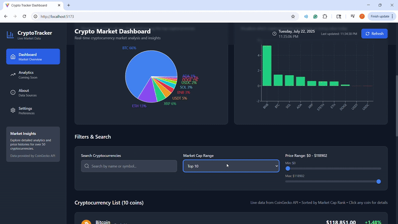

# Web Development Project 6 - *Crypto Tracker Dashboard*

Submitted by: **Thao Nguyeyn**

This web app: **My Crypto Tracker Dashboard is a React app that pulls live market data from the CoinGecko API to display the top 50 cryptocurrencies with real‑time summary stats like total market cap, average 24‑hour change, and the day’s biggest gainers and losers. It features a dynamic search bar, market‑cap dropdown, and price‑range slider so users can instantly filter and explore coins by name, rank, or price band. The page also displays a detailed coin view whenever the user clicks on each coin, along with data visualizations that show the Market Cap Distribution and 24-hour Price Changes, allowing the user to quickly view the real-time coin value trend.**

Time spent: **6** hours spent in total

## Required Features

The following **required** functionality is completed:

- [x] **Clicking on an item in the list view displays more details about it**
  - Clicking on an item in the dashboard list navigates to a detail view for that item
  - Detail view includes extra information about the item not included in the dashboard view
  - The same sidebar is displayed in detail view as in dashboard view
  - *To ensure an accurate grade, your sidebar **must** be viewable when showing the details view in your recording.*
- [x] **Each detail view of an item has a direct, unique URL link to that item’s detail view page**
  -  *To ensure an accurate grade, the URL/address bar of your web browser **must** be viewable in your recording.*
- [x] **The app includes at least two unique charts developed using the fetched data that tell an interesting story**
  - At least two charts should be incorporated into the dashboard view of the site
  - Each chart should describe a different aspect of the dataset

The following **optional** features are implemented:

- [x] The site’s customized dashboard contains more content that explains what is interesting about the data 
  - e.g., an additional description, graph annotation, suggestion for which filters to use, or an additional page that explains more about the data
- [x] The site allows users to toggle between different data visualizations
  - User should be able to use some mechanism to toggle between displaying and hiding visualizations 

## Video Walkthrough

Here's a walkthrough of implemented user stories:

Old version:

Updated features:

## License

    Copyright [2025] [Thao Nguyen]

    Licensed under the Apache License, Version 2.0 (the "License");
    you may not use this file except in compliance with the License.
    You may obtain a copy of the License at

        http://www.apache.org/licenses/LICENSE-2.0

    Unless required by applicable law or agreed to in writing, software
    distributed under the License is distributed on an "AS IS" BASIS,
    WITHOUT WARRANTIES OR CONDITIONS OF ANY KIND, either express or implied.
    See the License for the specific language governing permissions and
    limitations under the License.
